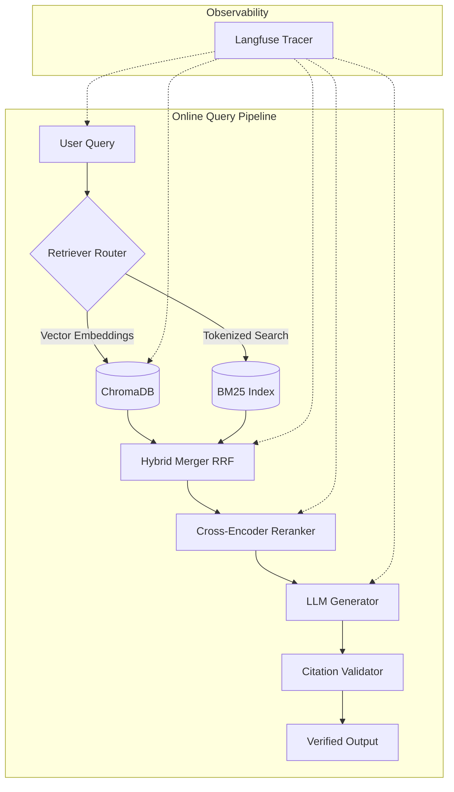

# RAG Scholar: Production-Grade Agentic Search Pipeline

RAG Scholar is an advanced, production-ready Retrieval-Augmented Generation (RAG) system built to parse, search, and synthesize complex machine learning research papers. Engineered from the ground up for high reliability, the system focuses heavily on **search precision**, **observability**, **evaluation**, and **architecture scalability**.

## 🚀 Key Technical Highlights

* **Hybrid Search with Reciprocal Rank Fusion (RRF)**: Combines Dense Vector Search (ChromaDB + SentenceTransformers) with Sparse Keyword Search (BM25) to capture both semantic meaning and exact terminology.
* **Cross-Encoder Reranking**: Re-ranks the fused results using a deep Cross-Encoder model to ensure context relevancy before passing to the LLM.
* **Strict Citation Generation**: A rigorous prompt engineering pipeline that forces the LLM to ground all claims with explicit `[doc_id]` citations, validated at runtime.
* **Production Observability**: Full integration with Langfuse via a custom wrapper, emitting structured traces for latency, token consumption, and cost tracking at every discrete step of the pipeline.
* **Ephemeral Document Sessions (V2)**: Features an isolated, in-memory processing pipeline for user-uploaded PDFs, dynamically instantiating ephemeral ChromaDB and BM25 instances that are instantly garbage-collected upon session end.
* **CI/CD Driven Evaluation**: Integrated with DeepEval to run an automated 100-question golden dataset evaluating for *Faithfulness* and *Answer Relevancy*, strictly gating pull requests based on rigid performance thresholds.

## 🏗️ Architecture

The system is decoupled into three primary execution domains: the Ingestion Pipeline, the Online Query Pipeline, and the Observability Layer.



## 🛠️ Technology Stack

* **Core/Backend**: Python 3.12, FastAPI, Pydantic, `uv` package manager
* **AI/ML**: `anthropic` (Claude Haiku 4.5), `sentence-transformers` (`all-MiniLM-L6-v2` & `ms-marco-MiniLM-L-6-v2`), `rank-bm25`, `ChromaDB`, `PyMuPDF`
* **Observability**: `langfuse`
* **Evaluation**: `deepeval`
* **Frontend**: React 18, TypeScript, Vite, Custom Vanilla CSS (Glassmorphism)

## 📦 Getting Started

### Prerequisites
* Python 3.12+
* Node.js v18+
* API Keys for Anthropic (`ANTHROPIC_API_KEY`) and optionally Langfuse (`LANGFUSE_PUBLIC_KEY`, `LANGFUSE_SECRET_KEY`)

### Backend Setup
```bash
# 1. Create a virtual environment
python -m venv .venv
source .venv/bin/activate

# 2. Install dependencies (we use uv for blazing fast resolution)
uv pip install -e .

# 3. Configure environments
cp .env.example .env
# Edit .env and insert your API keys

# 4. Ingest the default research corpus
python scripts/ingest.py

# 5. Start the FastAPI server
uvicorn src.api.routes:app --reload --port 8000
```

### Frontend Setup
```bash
cd frontend
npm install
npm run dev
```

Navigate to `http://localhost:5173` to interact with the UI.

## 🧪 Evaluation & Testing

RAG Scholar enforces a strict threshold on hallucination and context drift. The system is evaluated using the DeepEval framework against a golden dataset of 100 domain-specific QA pairs. 

**Latest Benchmark Results (`evals/report_20260708_015329.json`):**
- **Faithfulness Score:** 0.974
- **Answer Relevancy:** 0.965
- **Context Recall:** 0.966
- **Citation Accuracy:** 0.927
- **Average Latency:** ~5.1s

To run the evaluation suite yourself:
```bash
python scripts/evaluate.py
```
This triggers the LLM-as-a-judge (Claude 3.5 Sonnet) to score the system's outputs against the known context, generating a JSON report. A CI pipeline (GitHub Actions) ingests this report to gate PRs if the faithfulness metric drops below the defined threshold.

## 📁 Repository Structure

```
.
├── data/
│   └── papers/              # Raw ML research PDFs
├── src/
│   ├── api/                 # FastAPI routes and Pydantic schemas
│   ├── config/              # YAML parsing and env var loading
│   ├── generation/          # LLM Clients, Prompt Builders, Citation Checkers
│   ├── ingestion/           # PDF Loaders, Chunkers, BM25 Indexers
│   ├── llm/                 # Embedder and LLM Provider implementations
│   ├── observability/       # Langfuse Tracers and Metric Collectors
│   ├── pipeline/            # Core orchestrators (IngestPipeline, QueryPipeline)
│   ├── retrieval/           # Dense, Sparse, Hybrid logic and Rerankers
│   └── store/               # VectorStore (Chroma) and BM25Store memory handlers
├── frontend/                # React Vite application
├── scripts/                 # CLI entrypoints (ingest, cli, evaluate)
└── evals/                   # Golden datasets and generated reports
```

## 🤝 Next Steps (Optimization Phase)
This repository represents the completed *initial architecture*. Future work in the Optimization Phase involves heavily reviewing the implemented patterns and optimizing chunking strategies (e.g., experimenting with semantic chunking to improve token boundaries and retrieval fidelity). No fine-tuning is required; the focus remains entirely on pipeline engineering and retrieval optimizations.
